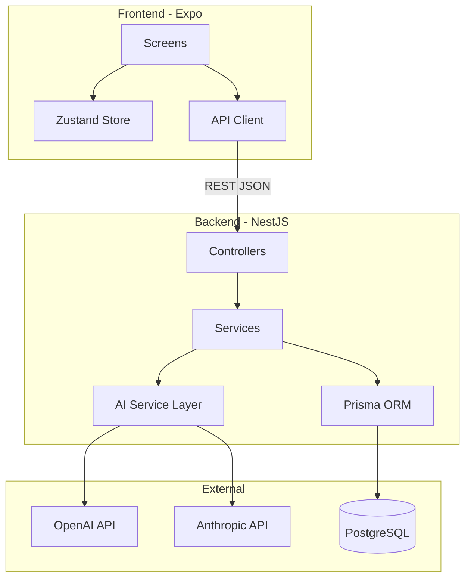
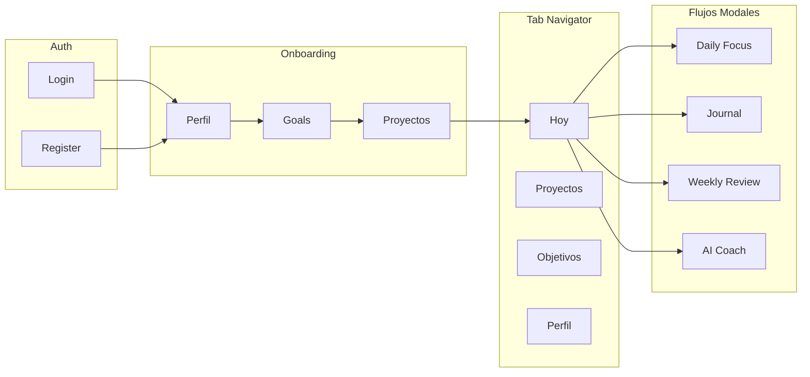

# Plan: BraiNext - Del PDR al Prototipo

## Parte 1: Mejoras al PDR

El [pdr.md](pdr.md) actual tiene buena base conceptual pero le faltan secciones criticas para poder ejecutar. Se agregaran:

### 1.1 Secciones faltantes

- **Seccion 8 - Flujo de Onboarding**: Como entra el usuario por primera vez. Sin esto, no hay forma de arrancar el core loop. Propuesta: wizard de 3 pasos (perfil -> 1-3 goals -> 1 proyecto por goal).
- **Seccion 9 - Stack Tecnico**: Documentar las decisiones de tecnologia.
- **Seccion 10 - Arquitectura de IA**: Que hace el AI coach en cada momento, que datos consume, que genera.
- **Seccion 11 - Estrategia de Notificaciones**: Como se activan los "momentos naturales" (push notifications configurables).
- **Seccion 12 - Mapa de Pantallas**: Flujo de navegacion principal.

### 1.2 Entidades faltantes en el modelo de datos

- **WeeklyReview**: No existe en el PDR pero el momento "Revision semanal" la necesita.
- **AIInsight**: Para guardar los outputs del coach (pattern analysis, sugerencias).
- **NotificationPreference**: Configuracion de horarios de recordatorios.

### 1.3 Mejoras al modelo existente

- `DailyFocus.main_focus` y `secondary_focus` deberian ser FK a `Action` o `Project`, no texto libre.
- `JournalEntry.alignment_score` deberia ser 1-5 (no 1-10, reduce friction cognitiva).
- Agregar `Action.completed_at` para tracking temporal.
- Agregar `Goal.target_date` para horizontes temporales concretos.

---

## Parte 2: Decisiones de Diseno

### 2.1 Stack Tecnico

```
Frontend:  Expo (React Native) + TypeScript
           React Navigation (navegacion)
           Zustand (estado local)
           TanStack Query (estado servidor)
           Nativewind (Tailwind para RN)

Backend:   NestJS + TypeScript
           Prisma ORM + PostgreSQL
           JWT Auth (Passport)
           Docker para desarrollo local

AI:        Capa abstracta con interface comun
           OpenAI (GPT-4o-mini) como provider inicial
           Preparado para Anthropic como alternativa

Infra:     Docker Compose (dev)
           Railway o Render (deploy prototipo)
```

### 2.2 Arquitectura General




### 2.3 Flujo de Navegacion (Pantallas)




### 2.4 Rol del AI Coach (por momento)


| Momento                                                      | Input para la IA | Output de la IA |
| ------------------------------------------------------------ | ---------------- | --------------- |
| No se pueden usar tablas en el plan. Reformulado como lista: |                  |                 |


**Inicio del dia (Decidir)**:

- Input: goals activos, proyectos, acciones pendientes, historial de los ultimos 7 dias
- Output: sugerencia de foco priorizado, alerta si hay patron de evitacion, pregunta provocadora

**Cierre del dia (Entender)**:

- Input: foco del dia, journal entry, acciones completadas/saltadas
- Output: reflexion sobre alineacion, deteccion de patrones (siempre saltas X tipo de tarea), pregunta de profundizacion

**Revision semanal (Ajustar)**:

- Input: todos los daily focuses + journals de la semana, estado de proyectos
- Output: resumen narrativo de la semana, recomendaciones (pausar proyecto X, doble down en Y), metricas de coherencia

---

## Parte 3: Sprints y Tareas Atomicas

### Sprint 0 - Fundacion (1 semana)

Setup de repositorio, tooling y estructura base. Sin funcionalidad visible.

### Sprint 1 - Auth + Onboarding + Modelo Base (2 semanas)

Registro, login, wizard de onboarding, CRUD de Goals y Projects.

### Sprint 2 - Daily Focus + Actions (2 semanas)

Flujo de inicio del dia, seleccion de foco, gestion de acciones.

### Sprint 3 - Journal + Cierre del dia (1.5 semanas)

Flujo de cierre del dia, journal con preguntas guiadas, evaluacion de alineacion.

### Sprint 4 - Weekly Review (1.5 semanas)

Flujo de revision semanal, evaluacion de proyectos, decisiones de continuar/pausar/cerrar.

### Sprint 5 - AI Coach (2 semanas)

Integracion de IA en los 3 momentos, capa de abstraccion de providers, generacion de insights.

### Sprint 6 - Polish + Notificaciones (1 semana)

Push notifications, ajustes de UX, manejo de errores, preparacion para testing real.

**Total estimado: ~11 semanas para el prototipo funcional completo.**

---

## Parte 4: Tareas Atomicas por Sprint

Ver los todos adjuntos para el desglose completo. Cada tarea es lo suficientemente pequena para completarse en 1-4 horas.